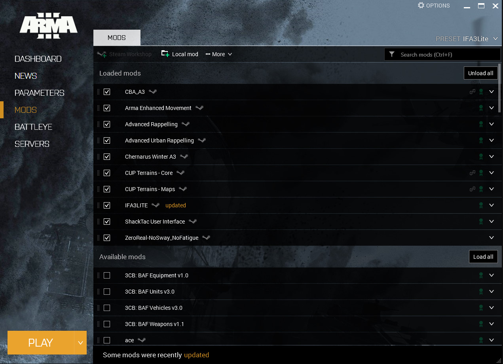

# Ajouter un add-on sur son serveur

## Création des dossiers

Pour commencer, vous devez créer à la racine de votre serveur Arma 3 un nouveau dossier appelé `@NOM_DE_VOTRE_MODPACK`


Il est requis que votre dossier soit préfixé d'un **@** sinon il ne sera pas reconnu par votre serveur.


Une fois le dossier crée, vous devez créer dans ce dossier deux nouveaux sous-dossiers, de manière à avoir cette structure : 

```
@NOM_DE_VOTRE_MODPACK
\__addons
\__keys
```

## Ajout des add-ons

Une fois la structure ci-dessus obtenue, vous pourrez donc venir placer vos fichiers d'add-ons respectifs comme ci-dessous : 

```text
@NOM_DE_VOTRE_MODPACK
\__addons
    \__fichier.pbo
    \__fichier.bikey
\__keys
    \__fichier.bisign
```

A savoir donc, qu'il faut placer correctement les fichiers en fonction de leur extension.


Vous aurez également la possibilité de rencontrer des addons / modpacks avec des fichiers à la racine, tels que **mod.cpp** ou encore des fichiers **.dll** par exemple. Ces fichiers devront être placés à la racine de votre dossier **@NOM\_DE\_VOTRE\_MODPACK** et ne doit surtout pas être dans un des deux sous-dossiers **/addons** ou **/keys** sinon ils ne seront pas reconnus.


## Activation des add-ons sur le serveur

Vous devez maintenant ajouter à vos options de lancement votre modpack pour que votre serveur le lance au démarrage. Vous devez donc trouver votre fichier de configuration de serveur, ou vous trouverez une option de lancement -mod. Il faudra donc ajouter à ceux déjà activés de base, votre modpack : 

```text
"-mod=@extdb; @life_server; @modpack"
```


La façon de faire diffère en fonction de votre installation, ou du système d'exploitation sur lequel votre serveur tourne. La méthode ci-dessus est faite pour une configuration de base sous Windows.


## Ajout et activation des add-ons côté client

Maintenant que votre serveur est démarré avec votre `@NOM_DE_VOTRE_MODPACK` il ne vous reste plus qu'à activer le modpack sur votre ordinateur. Téléchargez le donc, puis placer le dossier à la racine de votre jeu, qui est par défaut installé dans : `C:\Program Files (x86)\Steam\steamapps\common\Arma3`

Démarrez maintenant votre jeu, puis dans le launcher, rendez vous dans l'onglet "Mods" :   




Cliquez ensuite sur "Mod Local", puis allez chercher votre dossier @NOM\_DE\_VOTRE\_MODPACK, il va donc être ajouté à la liste \(comme ci-dessus\), il ne vous restera plus qu'à cocher la case, et il sera activé. 

Vous pouvez donc maintenant profiter de votre modpack.

